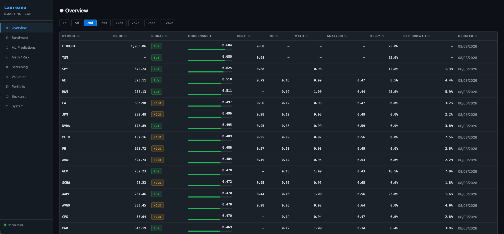
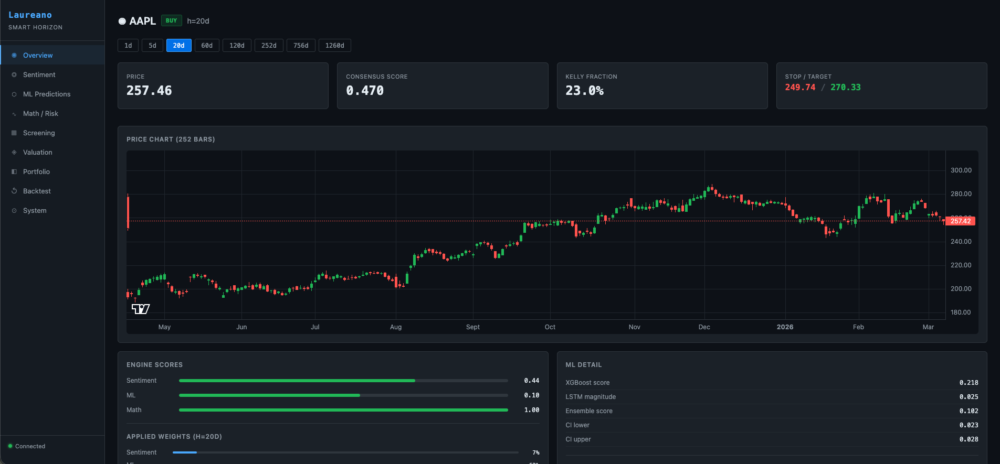
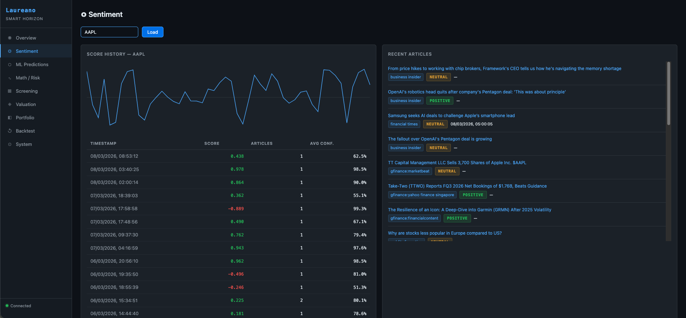
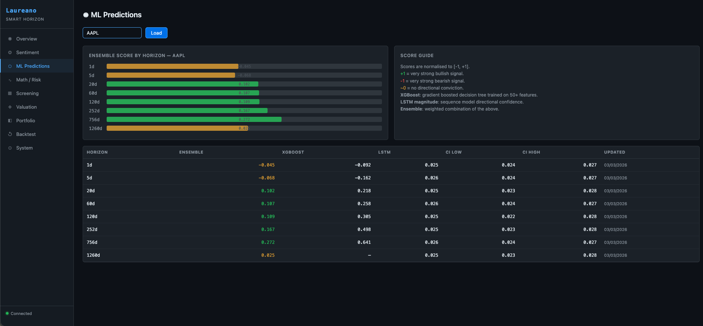
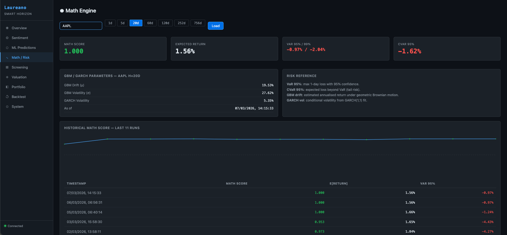
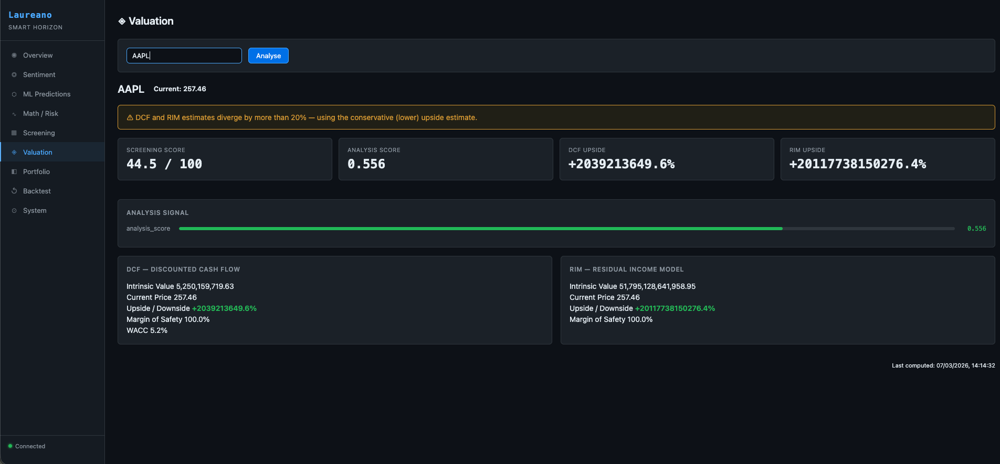
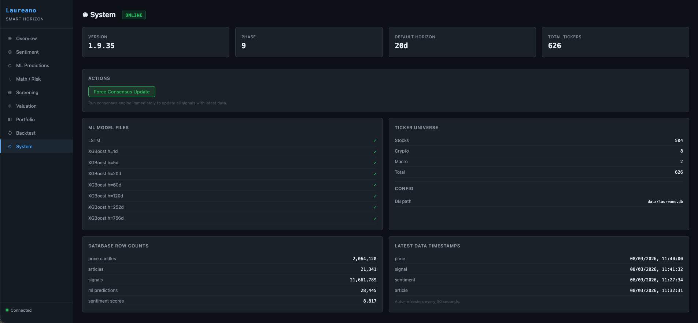

# Laureano — Smart Horizon Terminal

A fully autonomous quantitative investment system that combines four analytical engines into a single, horizon-adaptive consensus signal. Built for medium-to-long-term decisions (1 day to 5 years).

Named after my grandfather — a hard-working and thrifty man whose values inspire this project.

> **Status**: Live paper trading on Alpaca Markets (v1.9.35)
> **Stack**: Python 3.12, FastAPI, SQLAlchemy, PyTorch, XGBoost, structlog
> **Universe**: 500+ US equities (S&P 500), 8 crypto pairs, 100+ international stocks, macro indicators

---

## Architecture

```
                        DATA LAYER
            ┌──────────────────────────────┐
            │  Alpaca  Binance  yfinance   │
            │  Google Finance  SEC EDGAR   │
            └──────────────┬───────────────┘
                           │
            ┌──────────────▼───────────────┐
            │      FOUR ANALYTICAL ENGINES │
            │                              │
            │  Sentiment   ML   Math  Fund │
            │  (NLP)    (Ensemble) (MC) (DCF)
            └──────────────┬───────────────┘
                           │
            ┌──────────────▼───────────────┐
            │     CONSENSUS ENGINE         │
            │  Horizon-adaptive weighting  │
            │  S(h) = Σ wᵢ(h) · scoreᵢ   │
            └──────────────┬───────────────┘
                           │
            ┌──────────────▼───────────────┐
            │     TRADING BOT              │
            │  Kelly sizing, OCO exits,    │
            │  market regime filter, PDT   │
            └──────────────────────────────┘
```

The key insight: a 1-day trade and a 3-year position live in fundamentally different information regimes. The system knows this and weights its engines accordingly — sentiment dominates short horizons, fundamentals dominate long horizons, ML and math bridge the gap.

---

## The Four Engines

### 1. Sentiment Engine
Scrapes financial news from Google Finance, preprocesses articles through a local LLM (DeepSeek-R1:1.5b via Ollama), then scores them with a fine-tuned DeBERTa-v3 transformer. Includes Bayesian source reliability calibration and exponential recency decay.

### 2. ML Engine
An ensemble of XGBoost (gradient-boosted trees) and LSTM (recurrent neural network with LayerNorm, positional encoding, and horizon conditioning). Trained on 50+ technical features per ticker. Produces directional confidence scores with uncertainty bounds (MC dropout).

### 3. Math Engine
Multi-model Monte Carlo simulation (5 models: GBM, Student-t, jump diffusion, Heston stochastic volatility, bootstrap) for expected return estimation. Dynamic take-profit/stop-loss from simulation percentiles. Full risk metrics: VaR, CVaR, GARCH volatility.

### 4. Analysis Engine (Fundamentals)
DCF and Residual Income Model valuations using live financial data. Systematic screening (P/E, ROE, debt ratios, margins). Integrated into the consensus formula for long-horizon signals.

---

## Consensus Formula

Each engine produces a score in [-1, +1]. The consensus engine blends them with horizon-adaptive weights:

```
S(h) = w_sentiment(h) · sentiment_score
     + w_ml(h)        · ml_score
     + w_math(h)      · math_score
     + w_analysis(h)  · analysis_score
```

Where weights follow exponential curves parameterized by time constants:
- **Sentiment** peaks at short horizons (tau = 7 days), decays quickly
- **ML** peaks around 1 month (tau = 30 days)
- **Math** grows through 1-3 months (tau = 90 days)
- **Analysis** dominates at 1 year+ (tau = 365 days)

A return-adjusted blend and Kelly criterion gate further refine signal quality.

---

## Trading Bot

Fully autonomous execution via Alpaca Markets API:

- **Position sizing**: Kelly criterion with portfolio fraction caps
- **Entry**: Notional (dollar-based) orders, extended hours support
- **Exit management**: GTC OCO orders (take-profit + stop-loss), fractional share support
- **Dynamic TP/SL**: Percentiles from Monte Carlo simulations, auto-refreshed when risk profile changes >1%
- **Market regime filter**: Reduces position sizes by 50% when SPY trades below its 20-day SMA
- **Position review**: Auto-exits on consensus decay, expected return decay, or SELL signal
- **Rotation**: At max positions, swaps weakest holding for stronger opportunity
- **Safety**: PDT protection, cooldown periods, staleness guards on price data

---

## Dashboard

A real-time web terminal served by the FastAPI backend.

### Overview — Market watchlist with consensus signals


### Ticker Detail — Price chart, engine scores, applied weights, fundamentals

.png)

### Sentiment Engine — Score history, recent articles with source calibration


### ML Predictions — Ensemble scores by horizon with confidence intervals


### Math Engine — Monte Carlo parameters, VaR/CVaR, historical math scores


### Valuation — DCF and RIM models with screening scores


### System — Model status, database health, data freshness


---

## Technical Highlights

- **Fully local**: Runs on an 8GB MacBook Air. Sentiment inference, ML training, and Monte Carlo all on-device
- **600+ tickers**: Real-time price feeds for S&P 500, crypto, international markets (Japan, UK, Germany, Spain, India, Argentina, Australia)
- **21M+ signals**: Optimized SQLite queries with covering indexes for sub-second dashboard response
- **35 iterations**: From first line of code to live trading in ~5 weeks, tracked via structured iteration documents
- **743 tests**: Comprehensive test suite covering all engines, API endpoints, and trading logic
- **Zero paid APIs**: Core intelligence runs entirely on open-source models (DeBERTa, XGBoost, PyTorch LSTM, DeepSeek-R1)

---

## Evolution

The project evolved through 35 iterations, each building on the last:

| Phase | Iterations | What was built |
|-------|-----------|----------------|
| **1. Foundation** | 1-3 | FastAPI server, SQLite schema, price feeds (Alpaca, Binance, yfinance) |
| **2. Sentiment** | 4-8 | Google Finance scraper, FinBERT scoring, source calibration, recency decay |
| **3. ML Engine** | 9-12 | XGBoost classifier, LSTM with MC dropout, ensemble with uncertainty |
| **4. Math Engine** | 13-16 | GBM Monte Carlo, GARCH volatility, VaR/CVaR, Kelly criterion |
| **5. Consensus** | 17-20 | Horizon-adaptive weighting, signal generation, dashboard integration |
| **6. Preprocessing** | 20-22 | Ollama LLM preprocessing, DeBERTa-v3 fine-tuned model, backend rename |
| **7. Analysis** | 23-26 | DCF, RIM valuation, systematic screening, fundamentals integration |
| **8. Trading Bot** | 27-31 | Alpaca execution, OCO exits, multi-model MC, dynamic TP/SL |
| **9. Production** | 32-35 | Return-adjusted consensus, Kelly gate, position rotation, market regime, query optimization |

---

## Heritage

Laureano is the third generation of this system:

1. **invest** (2024) — C++ foundation, basic price feeds and technical indicators
2. **investV2** (2025) — C++20, added sentiment analysis via llama.cpp, triple-engine consensus
3. **Laureano** (2026) — Complete Python rewrite, four engines, autonomous trading, web dashboard

The thesis: for medium-to-long-term investments, decision latency in milliseconds is irrelevant. Decision *quality* is everything. Python maximizes the speed at which decision quality can be improved.

---

## License

This is a showcase repository. The source code is private.

If you're interested in the project or have questions, feel free to open an issue.
